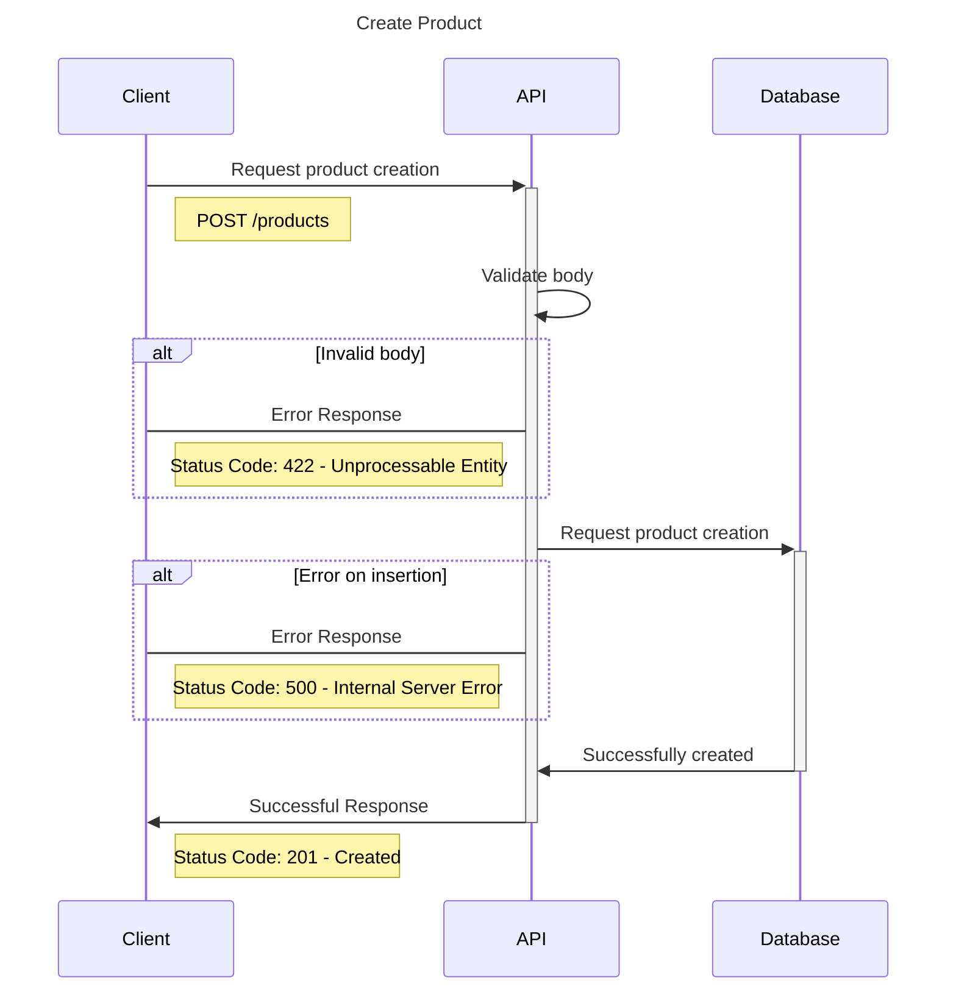
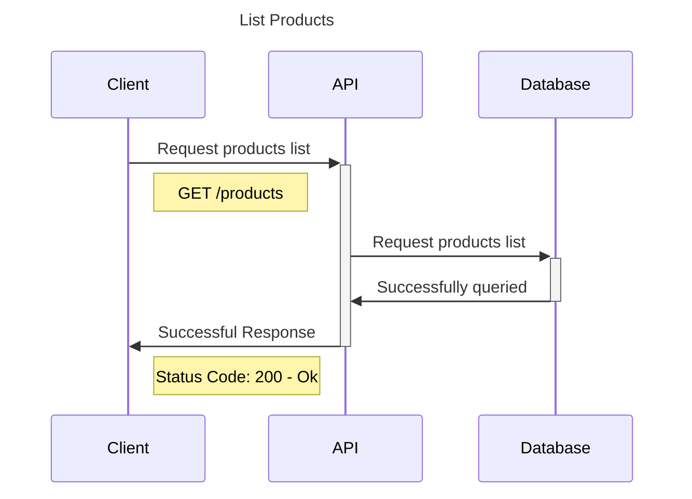
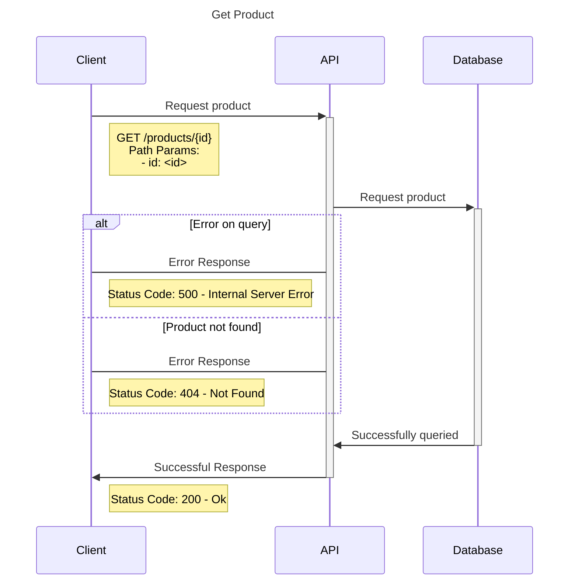
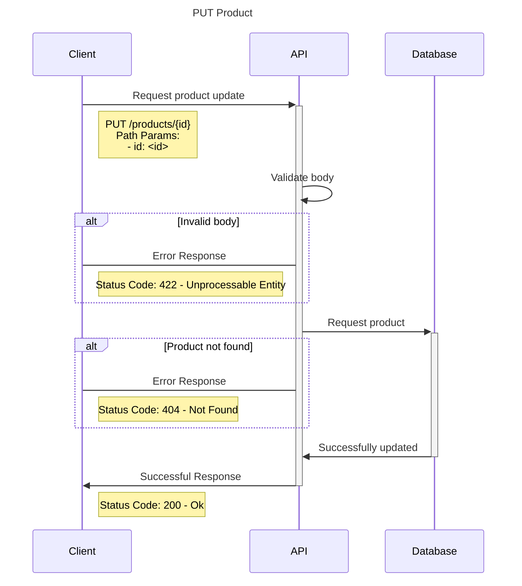
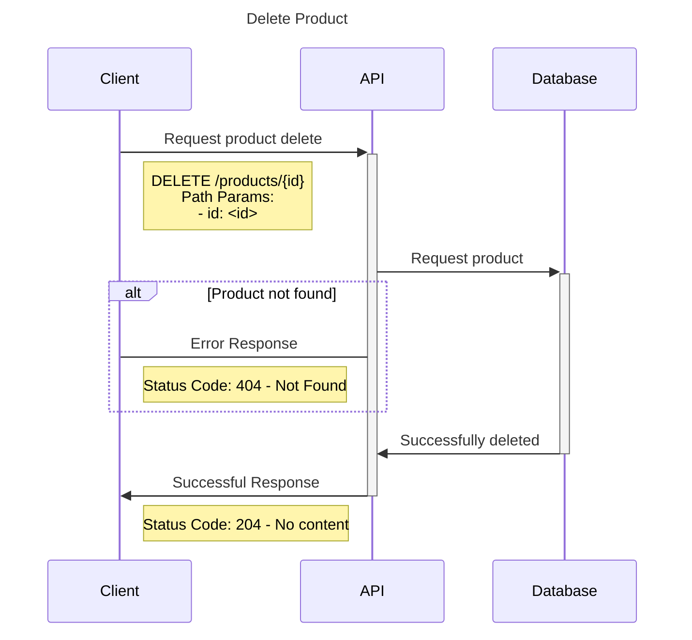

<h3 align="center">
  Criando Uma API Com FastAPI Utilizando TDD
</h3>

<h1>
    Python AI Backend Developer
</h1>

# FastAPI

## O que é TDD?
TDD é uma sigla para `Test Driven Development`, ou Desenvolvimento Orientado a Testes. A ideia do TDD é que você trabalhe em ciclos.

### Ciclo do TDD

## Vantagens do TDD
- entregar software de qualidade;
- testar procurando possíveis falhas;
- criar testes de integração, testes isolados (unitários);
- evitar escrever códigos complexos ou que não sigam os pré-requisitos necessários;

A proposta do TDD é que você codifique antes mesmo do código existir, isso nos garante mais qualidade no nosso projeto. Além de que, provavelmente se você deixar pra fazer os testes no final, pode acabar não fazendo. Com isso, sua aplicação perde qualidade e está muito mais propensa a erros.

# Store API
## Resumo do projeto
Este documento traz informações do desenvolvimento de uma API em FastAPI a partir do TDD.

## Objetivo
Essa aplicação tem como objetivo principal trazer conhecimentos sobre o TDD, na prática, desenvolvendo uma API com o Framework Python, FastAPI. Utilizando o banco de dados MongoDB, para validações o Pydantic, para os testes Pytest e entre outras bibliotecas.

## O que é?
Uma aplicação que:
- tem fins educativos;
- permite o aprendizado pr√°tico sobre TDD com FastAPI + Pytest;

## O que não é?
Uma aplicação que:
- se comunica com apps externas;

## Solução Proposta
Desenvolvimento de uma aplicação simples a partir do TDD, que permite entender como criar tests com o `pytest`. Construindo testes de Schemas, Usecases e Controllers (teste de integração).

### Arquitetura
||
|:--:|
| Diagrama de C4 da Store API |

### Banco de dados - MongoDB
||
|:--:|
| Database - Store API |

## StoreAPI
### Diagramas de sequência para o módulo de Produtos
#### Diagrama de criação de produto

```mermaid
    sequenceDiagram
        title Create Product
        Client->>+API: Request product creation
        Note right of Client: POST /products

        API->>API: Validate body

        alt Invalid body
            API->Client: Error Response
            Note right of Client: Status Code: 422 - Unprocessable Entity
        end

        API->>+Database: Request product creation
        alt Error on insertion
            API->Client: Error Response
            note right of Client: Status Code: 500 - Internal Server Error
            end
        Database->>-API: Successfully created

        API->>-Client: Successful Response
        Note right of Client: Status Code: 201 - Created
```
#### Diagrama de listagem de produtos

```mermaid
    sequenceDiagram
        title List Products
        Client->>+API: Request products list
        Note right of Client: GET /products

        API->>+Database: Request products list

        Database->>-API: Successfully queried

        API->>-Client: Successful Response
        Note right of Client: Status Code: 200 - Ok
```

#### Diagrama de detalhamento de um produto

```mermaid
    sequenceDiagram
        title Get Product
        Client->>+API: Request product
        Note right of Client: GET /products/{id}<br/> Path Params:<br/>    - id: <id>

        API->>+Database: Request product
        alt Error on query
            API->Client: Error Response
            Note right of Client: Status Code: 500 - Internal Server Error
        else Product not found
            API->Client: Error Response
            Note right of Client: Status Code: 404 - Not Found
            end

        Database->>-API: Successfully queried

        API->>-Client: Successful Response
        Note right of Client: Status Code: 200 - Ok
```
#### Diagrama de atualização de produto

```mermaid
    sequenceDiagram
        title PUT Product
        Client->>+API: Request product update
        Note right of Client: PUT /products/{id}<br/> Path Params:<br/>    - id: <id>

        API->>API: Validate body

        alt Invalid body
            API->Client: Error Response
            Note right of Client: Status Code: 422 - Unprocessable Entity
        end

        API->>+Database: Request product
        alt Product not found
            API->Client: Error Response
            Note right of Client: Status Code: 404 - Not Found
            end

        Database->>-API: Successfully updated

        API->>-Client: Successful Response
        Note right of Client: Status Code: 200 - Ok
```

#### Diagrama de exclus√£o de produto

```mermaid
    sequenceDiagram
        title Delete Product
        Client->>+API: Request product delete
        Note right of Client: DELETE /products/{id}<br/> Path Params:<br/>    - id: <id>

        API->>+Database: Request product
        alt Product not found
            API->Client: Error Response
            Note right of Client: Status Code: 404 - Not Found
            end

        Database->>-API: Successfully deleted

        API->>-Client: Successful Response
        Note right of Client: Status Code: 204 - No content
```

## Desafio Final
- Create
    - Mapear uma exceção, caso dê algum erro de inserção e capturar na controller
- Update
    - Modifique o método de patch para retornar uma exceção de Not Found, quando o dado não for encontrado
    - a exceção deve ser tratada na controller, pra ser retornada uma mensagem amigável pro usuário
    - ao alterar um dado, a data de updated_at deve corresponder ao time atual, permitir modificar updated_at também
- Filtros
    - cadastre produtos com preços diferentes
    - aplique um filtro de preço, assim: (price > 5000 and price < 8000)

## Preparar ambiente

Vamos utilizar Pyenv + Poetry, link de como preparar o ambiente abaixo:

[POETRY DOCUMENTATION](https://github.com/nayannanara/poetry-documentation/blob/master/poetry-documentation.md)

## Links uteis de documentação
[MERMAID](https://mermaid.js.org/)
[PYDANTIC](https://docs.pydantic.dev/dev/)
[PYTEST](https://docs.pytest.org/en/7.4.x/)
[MONGO MOTOR](https://motor.readthedocs.io/en/stable/)
[VALIDATIONS PYDANTIC](https://docs.pydantic.dev/latest/concepts/validators/)
[MODEL SERIALIZER](https://docs.pydantic.dev/dev/api/functional_serializers/#pydantic.functional_serializers.model_serializer)

## Licença

Este projeto é licenciado sob [CC0 1.0 Universal]. Consulte o arquivo [LICENSE](https://github.com/SilvaneiMartins/desafiodio-api-fastapi-tdd/blob/master/LICENSE) para obter detalhes.

## Informações do desenvolvedor

<a href="https://github.com/SilvaneiMartins">
    
     
    
        <b>Silvanei de Almeida Martins</b>
    
</a>
     
 
🚀 Feito com ❤️ por Silvanei Martins
